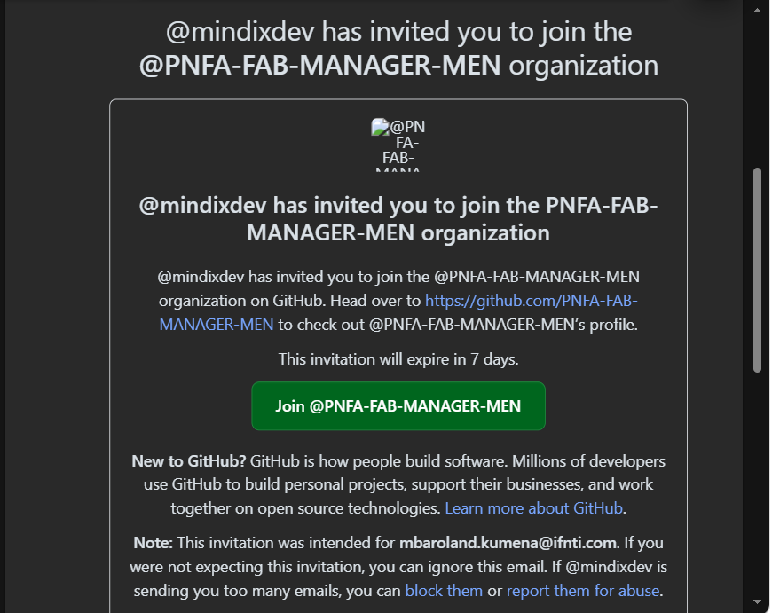
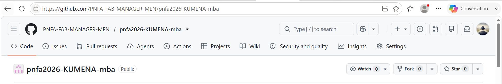
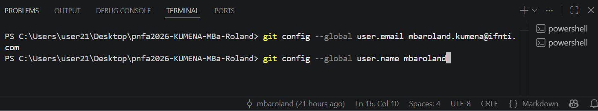
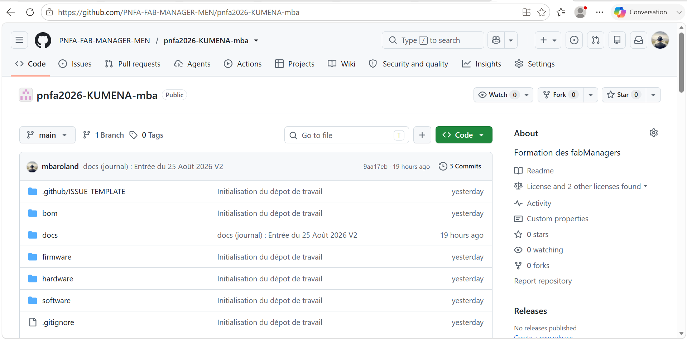

# Journal — Mardi 25 août 2026 (rédigé par : M'Ba Roland KUMENA)

## Fait aujourd'hui
- Reception du mail d'invitation de l'organisation

- Création du premier dépot dans l'organisation

- Initilisation du projet dans vscode
- configuration de l'identité de git avec la commande config avec les paramètres `user.name` et `user.name`.

- publication du projet sur github

- Module 2 : Decouverte du reseau Fablab et de sa charte

## Appris
- Création d'un dépot sur github.
- Faire un commit git sur Vscode et la
- publication sur le dépot distant github

## Raté, puis corrigé

- Echec de visualisation des image dans le journal.
Cela était dû à une erreur de syntaxe sur le chemin vers le fichier image.

## Décidé

- Il est recommandé de ne pas modifié le directement sur dépot github de peur d'avoir des conflits avec le dépot local sur git.

## À faire demain

- Généralité sur l'électronique et les autres modules — Roland

