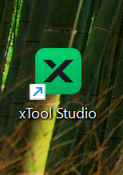
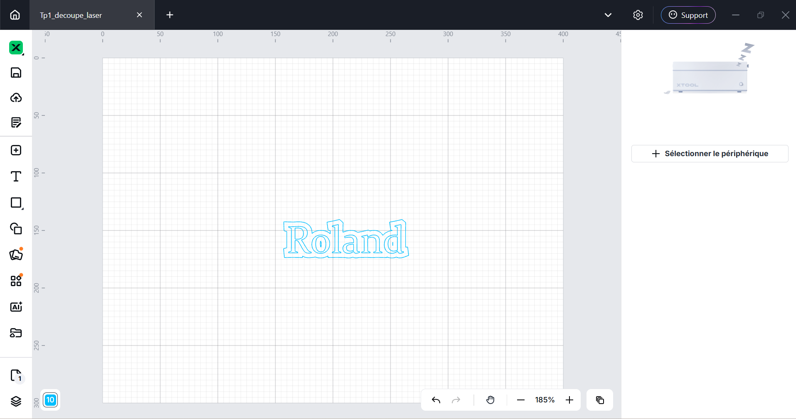
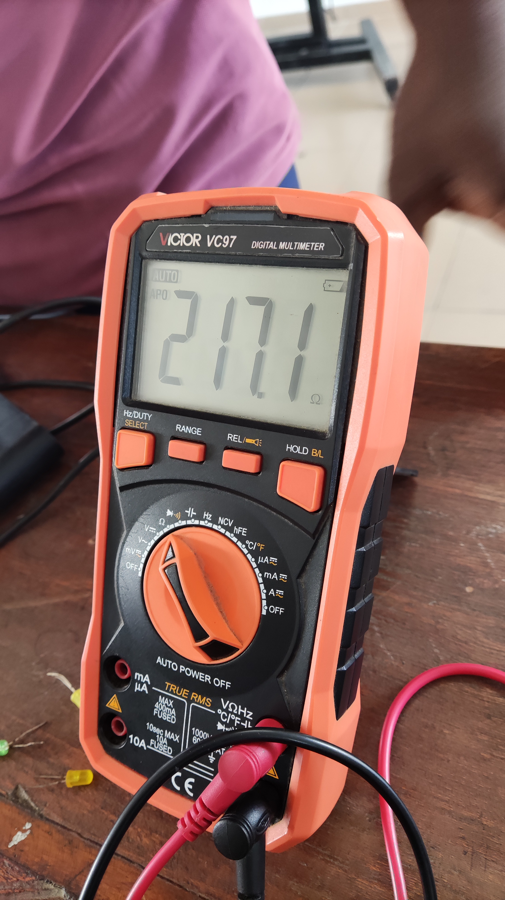
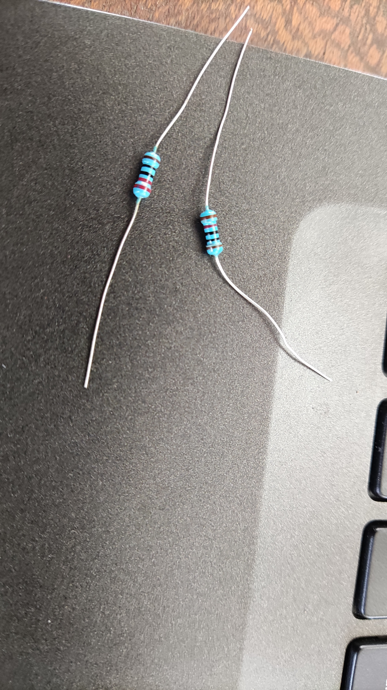

# Journal — Mercredi 26 août 2026 (rédigé par : M'Ba Roland KUMENA)

## Fait aujourd'hui

- Module de la découpe Laser
    - Anatomie d'une découpeuse
    - les grandes familles de lasers industriels
    - les quatre (4) machines xTool
    - Installation du logiciel xTool Studio
    
    - Premier pas avec xTool 
    

- les bases de l'électronique dans les FabLabs
    - l'utilisation du multimètre pour mesurer la tension des générateurs (piles)et la resistance.
    
    - Determination de la valeur d'une resistance à partir de ses bandes colorées.
    
    
- Module de Fabrication additive.

## Appris
- Premier pas avec le logiciel xTool studio
- le multimètre a plusieurs fonction (mesurer la tension, le courant, la résistance, ... ) 
- Utilisation du multimètre pour mesurer la tension d'un générateur et la résistance 

## Raté, puis corrigé

- La valeur de la tension aux bornes du générateurs qui apparait négative.
Cela est dû à l'insersion des bornes du multimètre.
- Une fausse valeur qui s'affiche sur le multimètre lors de la mésure de la resistance.
Cela était dû à la resistance du corps de celui qui tenait les broches de la résistance.
Nous avons utilisé la planche pour placer la résistance et refaire les mésures.  

## Décidé

- Le multimètre se branche en dérivation(parallèle) aux bornes du générateur pour mésurer la tension.
- Le multimètre se branche en serie dans le circuit pour mesurer le courant.
- Jamais branché le multimètre aux bornes du générateur dans le but de mésurer le courant.D'où le courant est mésuré aux bornes des recepteurs. 

## À faire demain

- Cahier de charge du projet de soutenance — Roland
