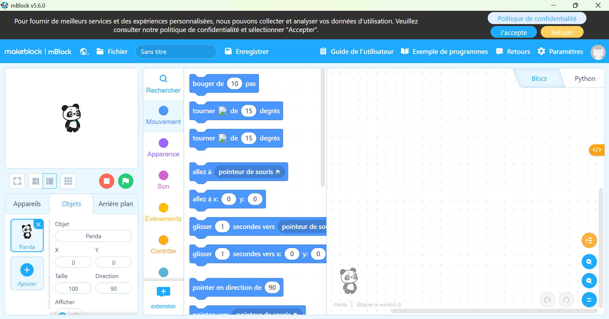
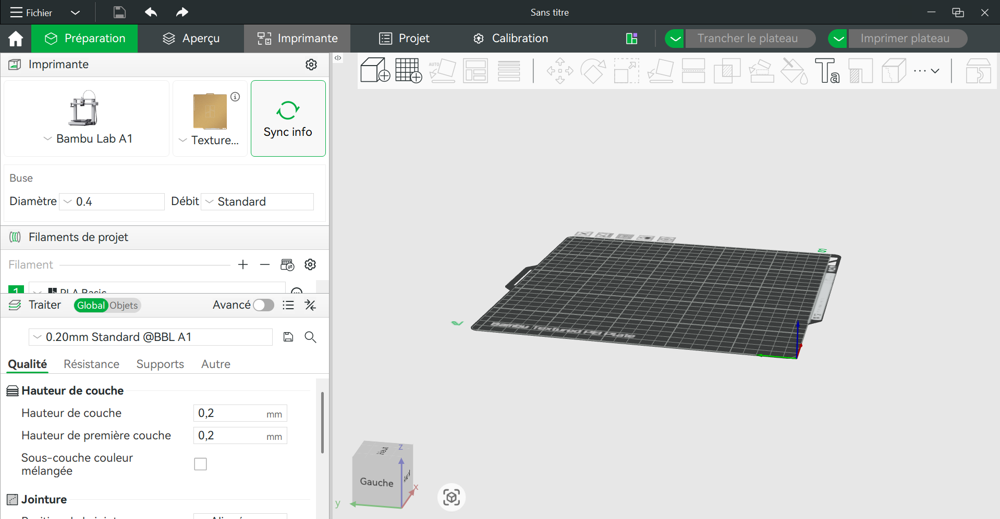
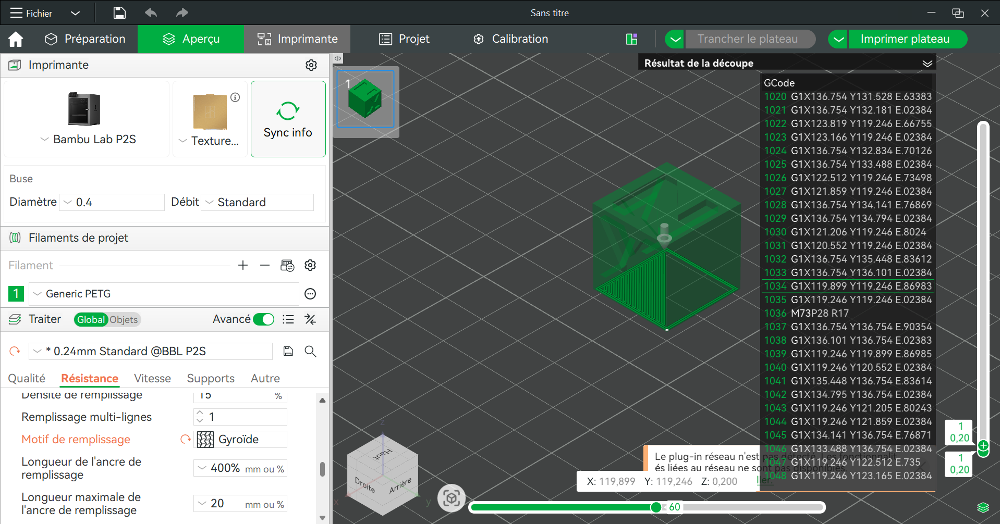
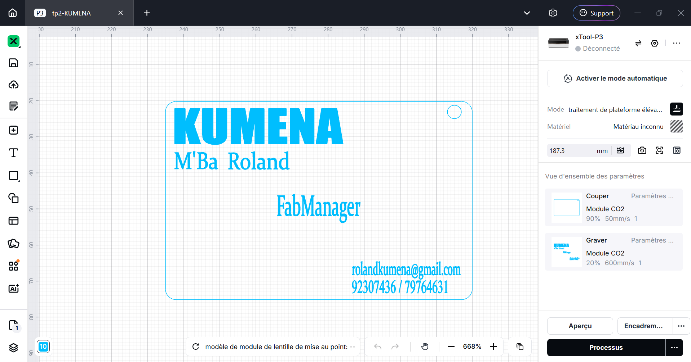

# Journal — Jeudi 27 août 2026 (rédigé par : M'Ba Roland KUMENA)

## Fait aujourd'hui
- **CyberPi et l'ecosystème mbuild**
    - **les capteurs/les actionneurs**  
    Nous avons eu à mettre la différence entre un capteur (envoie une information vers un programme)  et un actionneur (recoit une instruction/commande d'un programme).  
    Nous avons observé et toucher du doigts les capteurs comme le capteur à ultrasons sons, humidité, luminosité, bouton  

    - **le cyberPi**  
    Mini-ordinateur qui permet de faire la programmation à l'échelle éducatif.  

    - **Mblock**  
    Découverte du logiciel mblock qui est un logicel de programation éducatif. Il permet la programmation par block.  

    
    - **Premier programme dans mblock**
    Le programme permet d'allumer les led du CyberPi l'une après l'autre et inversement.

- **Module Fabrication additive**
    - **Bambu studio**  
    Installation et decouverte de l'interface du logiciel de découpe Bambu studio.  

      
    Importation d'un projet sur Bambu studio et première manipulation.

      
- installation du logiciel de modelisation Autodesk Fusion.
- **Découpe Laser**  
Cette séance a été consacré à la réalisation d'une carte de visite dans le logiciel Xtool et de son impression dans une machine P3.
  

## Appris
- Identifier quelques capteurs et actionneurs
- Réaliser un programme sur mblock
- confectionner et parametrer pour une impression avec laseur sur du bois 

## Raté, puis corrigé

- Echec de l'installation du logiciel Autodesk Fusion. Cela est dù à la connexion lente.

## Décidé

-  Pour une découpe laser 3 paramètres indispensable à savoir:
    - la puissance du laser
    - la vitesse de la tête d'impression
    - le nombre de passe du laser

## À faire demain

- Installation de Autodesk Fusion — Roland