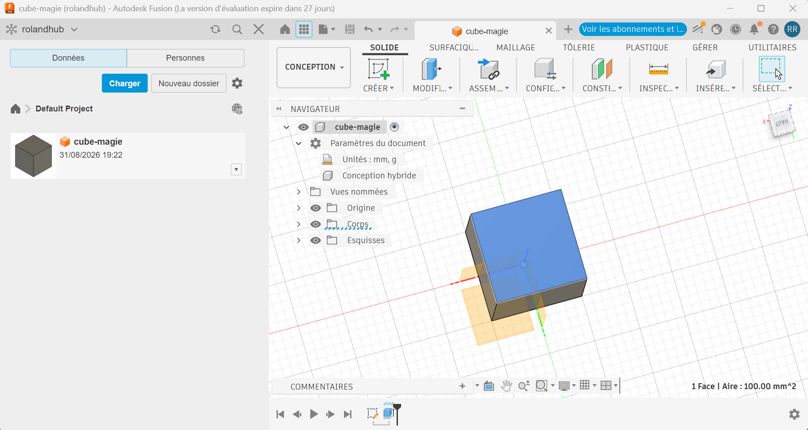

# Journal — Lundi 31 août 2026 (rédigé par : M'Ba Roland KUMENA)

## Fait aujourd'hui
- **Cahier de charge du projet**  
    Nous avons recherché les composants pour la réalisation du projet du projet carrefour de sécurité routière.
    Nous avons également eu à realiser le cahier de charge du projet.
- **Bases de la modélisation 3D sur Fusion 360** 
Nous avons terminé l'installation et la configuration de Fusion 360. Ensuite nous avons découvert l'interface et les menus de Fusion 360. Nous avons effectué la première manipulation en réalisant un cube en partant d'une forme rectangle

    

## Appris
- Les outils présents dans Fusion 360
- la création d'une esquisse sur fusion à partir des formes existantes (rectangle, cercle ...)
- Mise en place des contraintes sur objet en définissant les dimensions

## Raté, puis corrigé

-
## Décidé
-

## À faire demain
- Réalisation de l'esquisse du carrefour sur le logicielle Xtool studio — Groupe 4