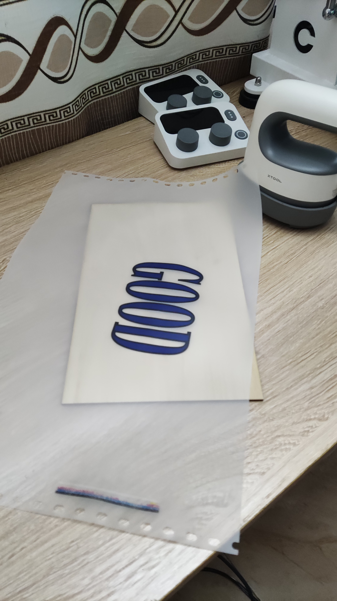
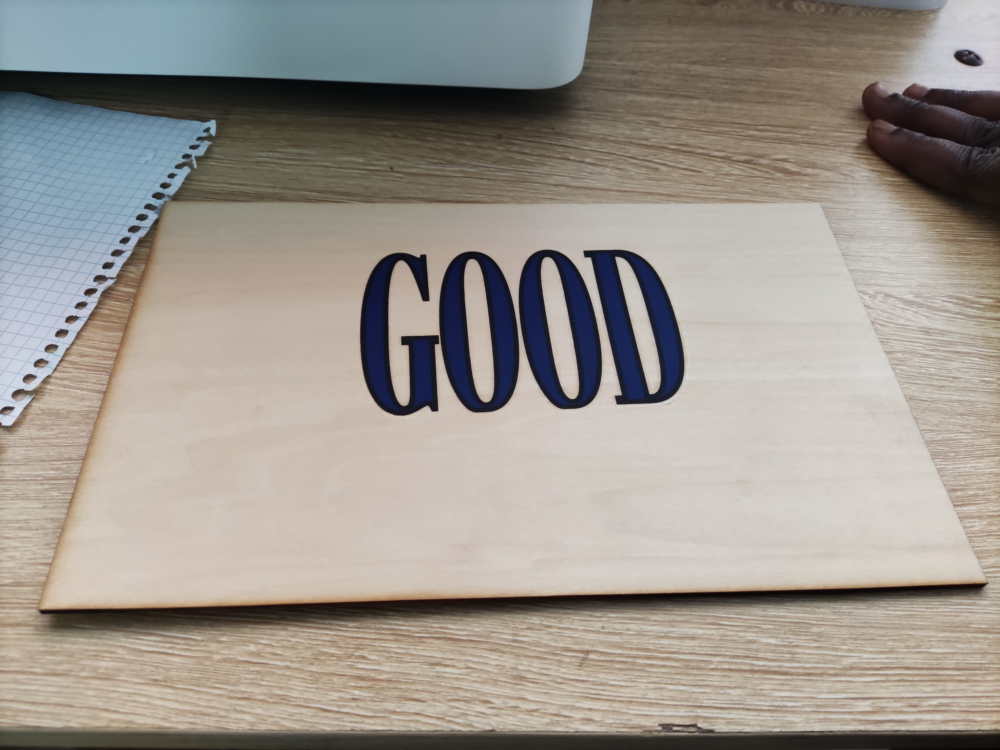
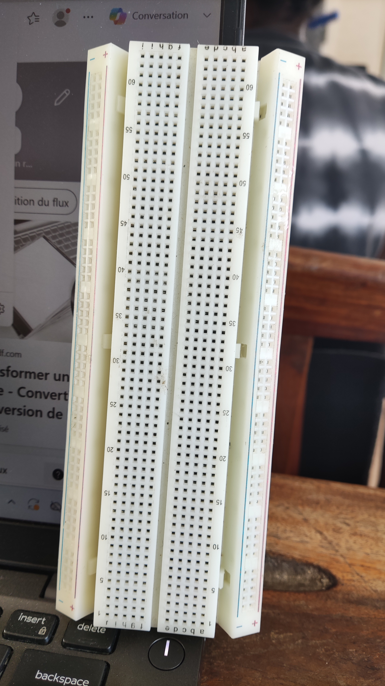
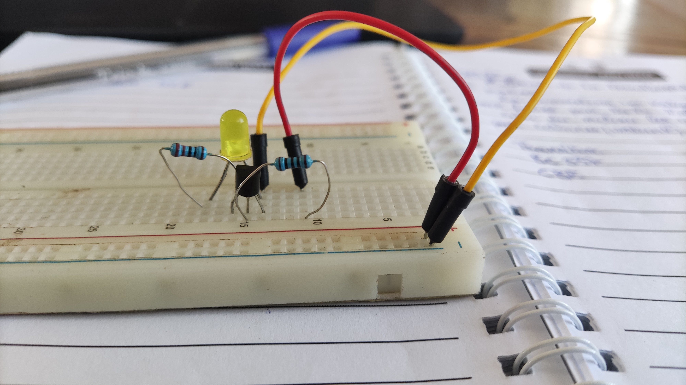
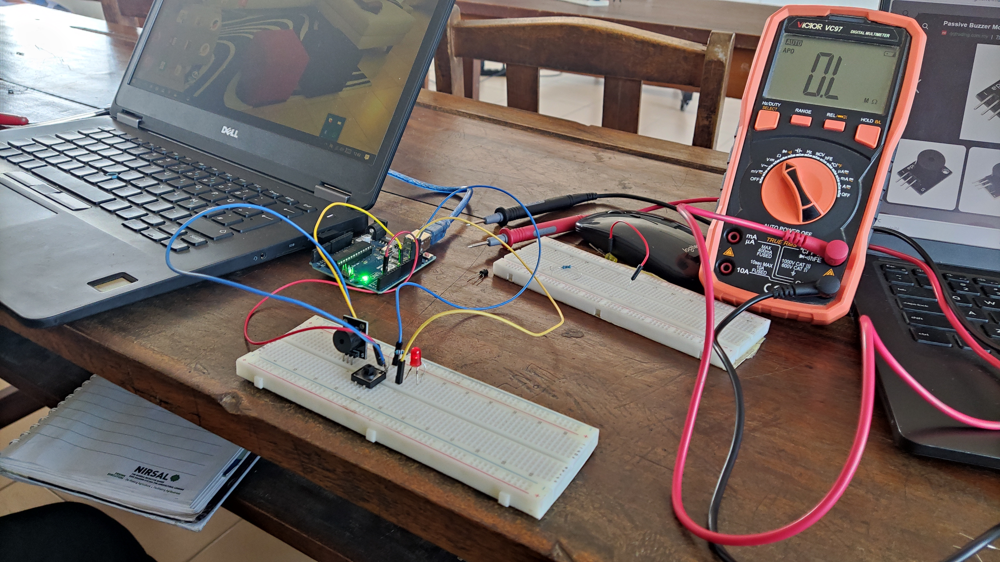
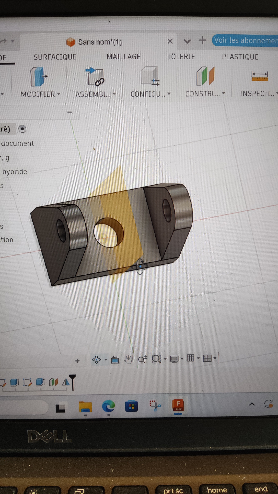
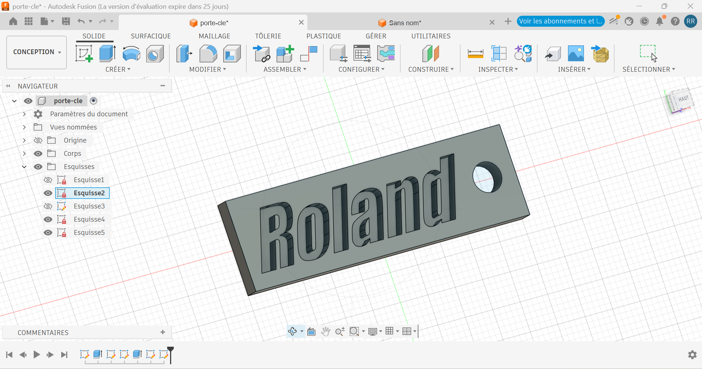

# Journal — Mardi 01 Septembre 2026 (rédigé par : M'Ba Roland KUMENA)

## Fait aujourd'hui
- **Impression DTF**  
    Nous avons suivi le cours et réalisé la première manipulation de la conception sur xtool studio jusqu'à la retraction du film après refroidissement.
    
    

- **Maitrise de la Breadboard SK10** 
Au cours de cette séance nous avons découvert comment branché les composants sur la Breadboard. Nous avons réalisé des circuit avec des led en parallèle, avec des transitor, un buzzer, une carte arduino.

- **Modélisation de sur Fusion 360**

Modélisation d'un cylindre à partir estirpation  d'un cercle ou revolution d'un rectangle  

Modelisation d'une forme complexe en utilisant les méthode d'estirpation, de dimensionnement, de projection.

Modelisation d'un porte clé avec du texte gravée.

    

## Appris
- Les outils présents dans Fusion 360
- la création d'une esquisse sur fusion à partir des formes existantes (rectangle, cercle ...)
- Mise en place des contraintes sur objet en définissant les dimensions.
- La projection.
- la revolution

## Raté, puis corrigé

-
## Décidé
-

## À faire demain
- Réalisation de l'esquisse du carrefour sur le logicielle Xtool studio — Groupe 4