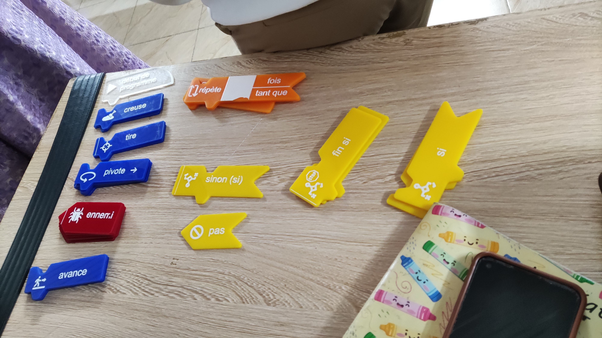
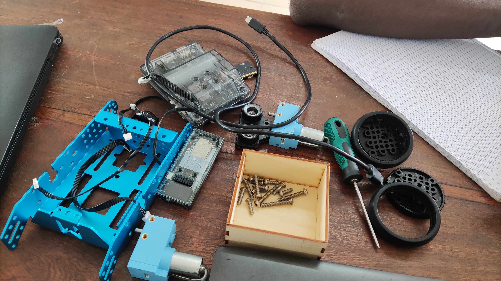

# Journal — Mercredi 02 Septembre 2026 (rédigé par : M'Ba Roland KUMENA)

## Fait aujourd'hui
- **Base Algorithimique**  
    - Définition de l'algorithme et les notions de l'algorithimique. 
    - Historique de l'algorithme
    - Exercice: réalisation d'un algorithme débranché.  

  

- **Robot mbot2**  
visionnage de la vidéo de montage d'un robot mbot2.
Montage du robot mbot2  

 
Programme pour faire avancer le robot mbot2  

Test et demontage du robot mbot2.  

- **Projet**
    - realisation de la maquette sur papier avec définition des dimensions de la maquette des routes.
    
    

## Appris
- Montage et démontage d'un robot mbot2

## Raté, puis corrigé
- difficulté de connexion des connecteurs entre les composants. 
## Décidé
-Un bon algorithme doit être une suite d'instructions ordonnéesn, finies et qui resolvent un problème donné.

## À faire demain
- Réalisation de l'esquisse du carrefour sur le logicielle Xtool studio — Groupe 4
- Réalisation du modelisation des mats des feux tricolores sur Fusion 360.