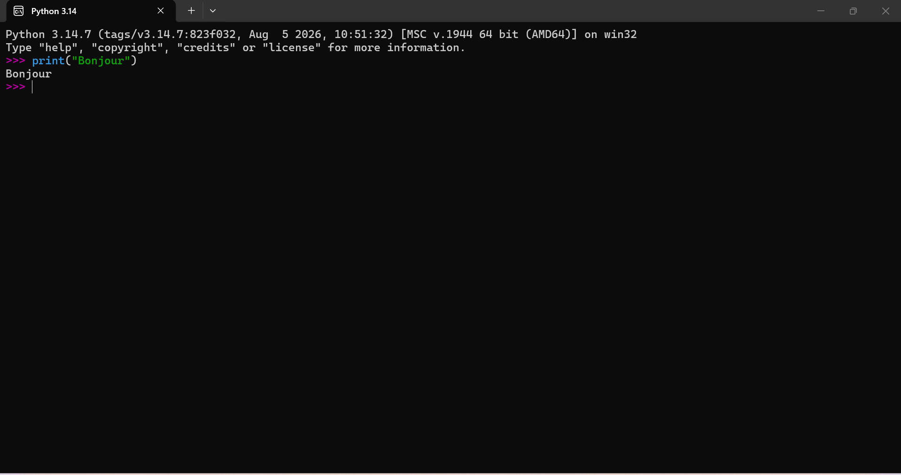
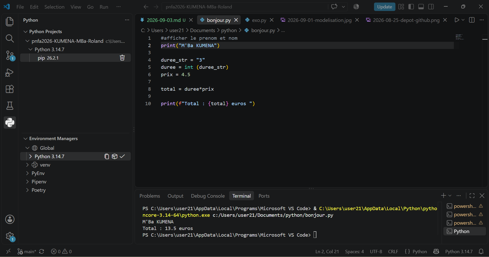
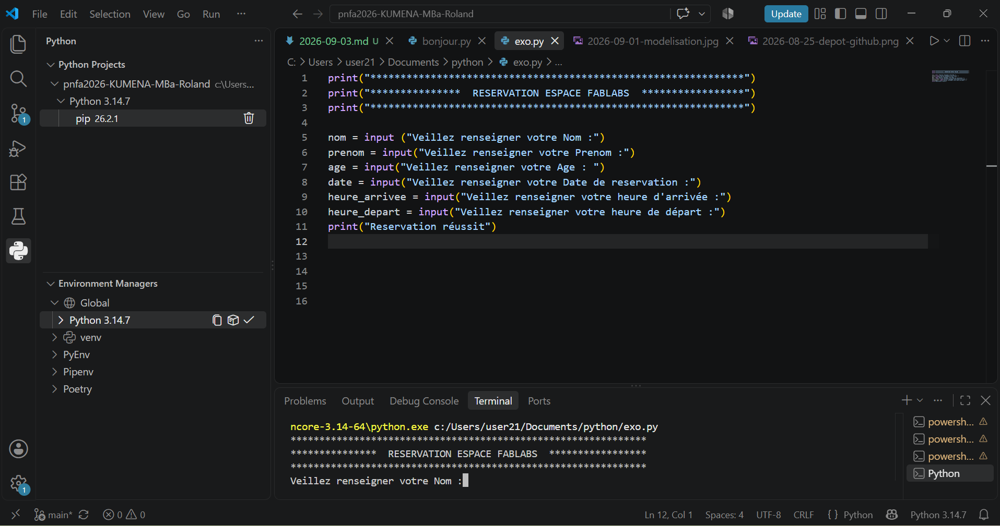
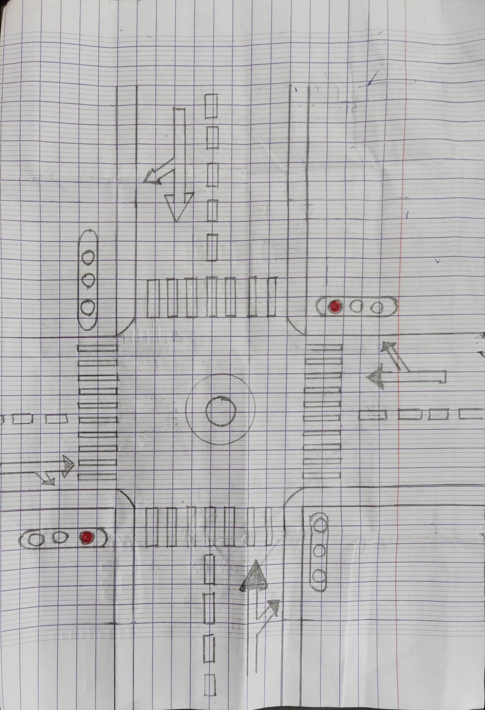
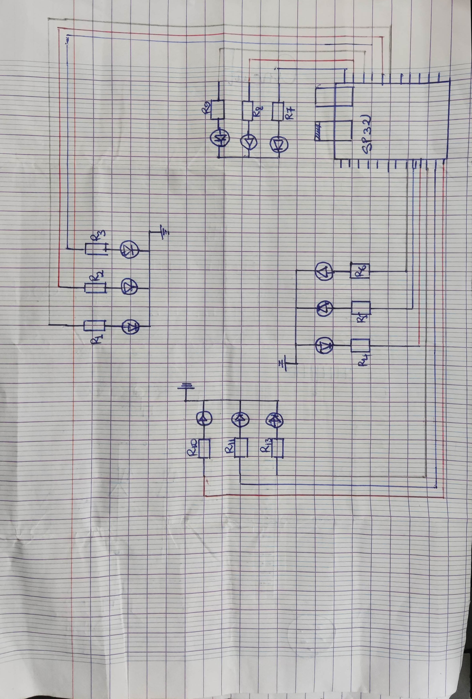

# Journal — Jeudi 03 Septembre 2026 (rédigé par : M'Ba Roland KUMENA)

## Fait aujourd'hui
- **Les bases du langage de programation python**  
    - installation de python 3.14
    
    - pris en main de python 
        - print ()
        - variables
        - type 
        - input()
    - exercice  
     

    

- **Projet**
    - realisation de la maquette sur papier avec définition des dimensions de la maquette des routes.
    

    - Réalisation du circuit
    
    

## Appris
- Afficher un texte à l'écran avec l'instruction **print**
- Commenter un code python avec **# au debut de la ligne**
- délaration des variables et les types de variables.
- Recupérer l'entrée de l'utilisateur 

## Raté, puis corrigé
-  
## Décidé
-Le langage de programmation python est polyvalent et fortement typé.
- Le nom d'une variable ne dois pas contenir un espace et il existe des mots reservés comme true, false.

## À faire demain
- Réalisation de l'esquisse du carrefour sur le logicielle Xtool studio — Groupe 4
- Réalisation du modelisation des mats des feux tricolores sur Fusion 360.