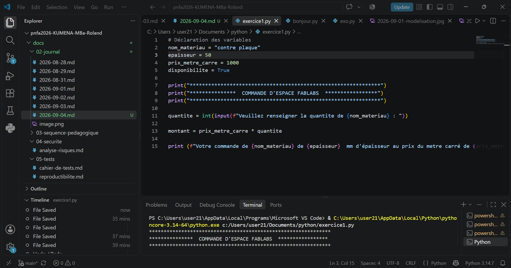
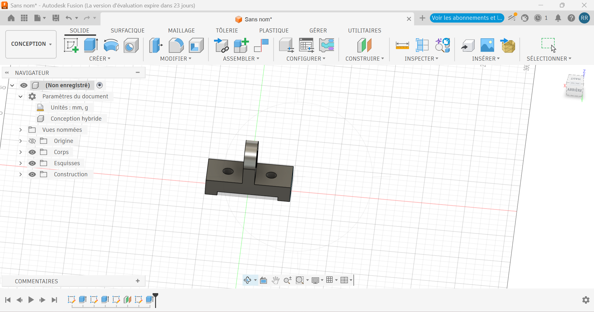

# Journal — Vendredi 04 Septembre 2026 (rédigé par : M'Ba Roland KUMENA)

## Fait aujourd'hui
- **Les bases du langage de programation python**  
    - exercice de synthèse de la séance passée
    
    - Les structures conditionnelles 
        - if/elif/else
        - exercice
    - Les boucles
        - La boucle for
        - La boucle while
    - les types de données complexe
        - les listes 
        - les tuples
        - les dictionnaires
      
    

- **Modelisation 3D**
    - realisation de la modelisation d'une forme complexe
    

- **Fabrication des PCB***
    - cours sur la conception des PCB.
    

## Appris
- Faire les instructions conditionnelles
- Faire les boucles
- Decouvert les listes, les tuples, les dictionnaires

## Raté, puis corrigé
-  
## Décidé
-

## À faire demain
- Réalisation de l'esquisse du carrefour sur le logicielle Xtool studio — Groupe 4
- Réalisation du modelisation des mats des feux tricolores sur Fusion 360.