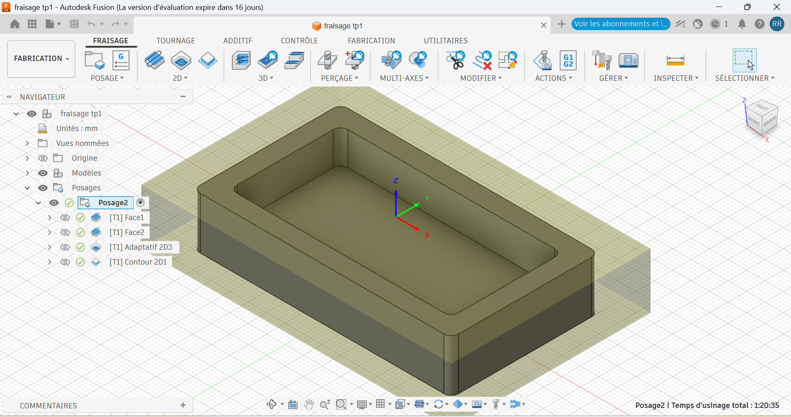
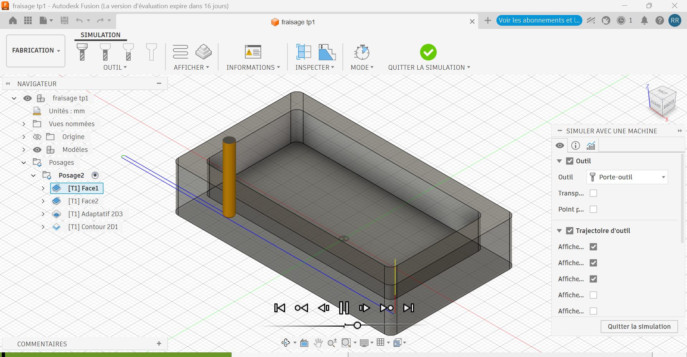

# Journal — Mardi 08 Septembre 2026 (rédigé par : M'Ba Roland KUMENA)

## Fait aujourd'hui
- **Cours d'initiation au FAO (Fabrication Assistée par l'Ordinateur)**  
    - modelisation d'une cuve sur Fusion 360
    
    - configuration pour le fraisage sur Fusion 360
    - simulation de fraisage
    

    

 **Projet**  
 - Correction des imperfections sur les supports des feux tricolores notamment sur la face de led et le diamètre de racordement du poteau et du boitier.
 - Conception de la maquette de l'école sur Xtool studio.
 - Découpe laser de l'école dans la Xtool-P3
 - Assemblage de des pièces découpées de l'école
 - Impression des supports du feux tricolores version final pour le lendemain (poteau , boitier, face de led)

## Appris
- La Fabrication Assistée par l'Ordinateur
- La conception d'une maquette dont les pièces seront découpées et assemblées

## Raté, puis corrigé
-  Le dimensionnement des led sur la face des led. cela est du à une erreur de calcul lors de la modelisation sur Fusion 360.
## Décidé
- 

## À faire demain
- Finalisation de l'esquisse du carrefour sur le logicielle Xtool studio — Groupe 4
- Découpe laser du carrefour sur Xtool P3 et impression du sur le film du carrefour dans Appareil Printer et collage sur la découpe  — Groupe 4

