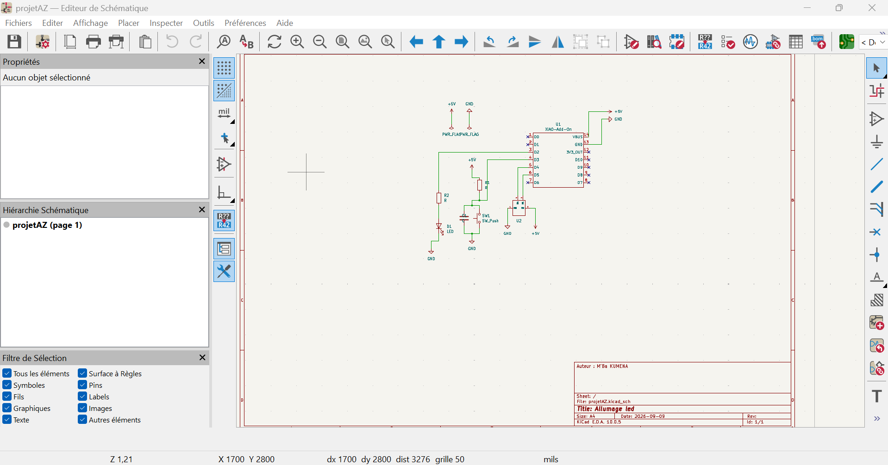
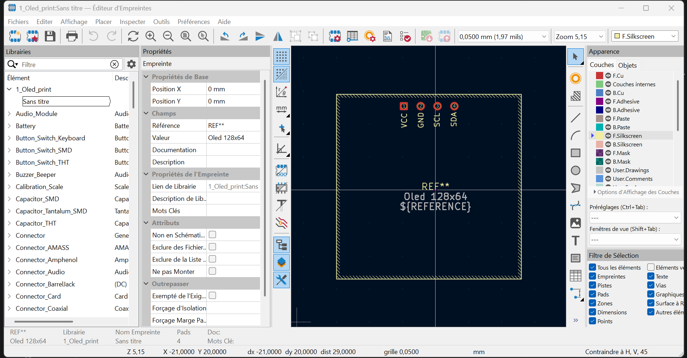
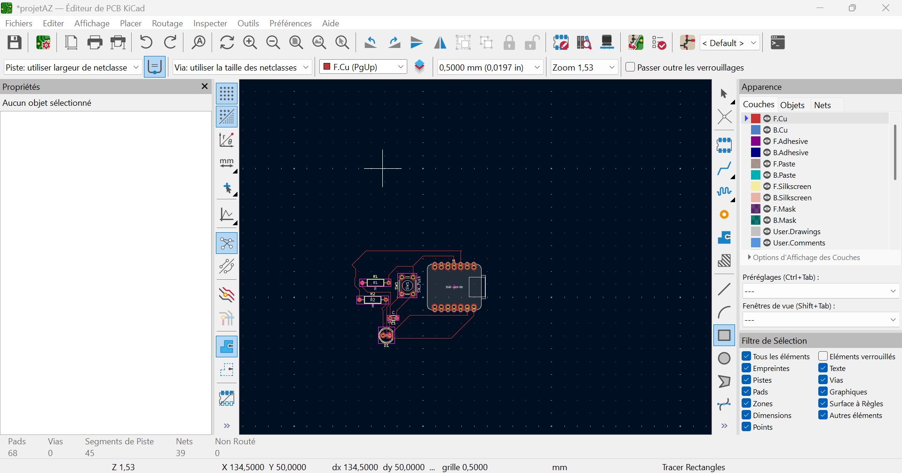

# Journal — Mercredi 08 Septembre 2026 (rédigé par : M'Ba Roland KUMENA)

## Fait aujourd'hui
- **Projet de réalisation  d'un projet complet**  
    - modelisation d'un circuit  PCB sur Kicad
    
    - Ajout de la librairie pour le composant Xiao SP32S3
    - Ajout du composant Oled.
        

    - connexion des composant sur le PCB dans kiCad.
    

    - Les notions en informatique pour apprendre tous les langages de programation.
    

 **Projet**  
 - Mise au point de l'avancée du projet

## Appris
- conception d'un PCB sur Kicad
- Ajouter une librairie
- Ajouter un composant qui n'existe pas dans une librairie kicad 

## Raté, puis corrigé
-  Difficulté de connexion des fils entre les composants
## Décidé
- 

## À faire demain
- Finalisation de l'esquisse du carrefour sur le logicielle Xtool studio — Groupe 4
- Découpe laser du carrefour sur Xtool P3 et impression du sur le film du carrefour dans Appareil Printer et collage sur la découpe  — Groupe 4

