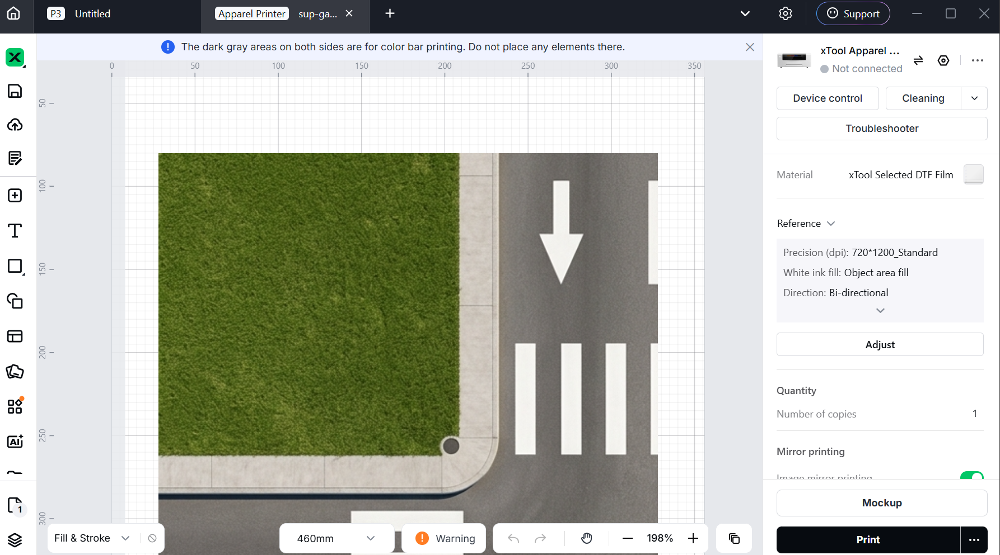
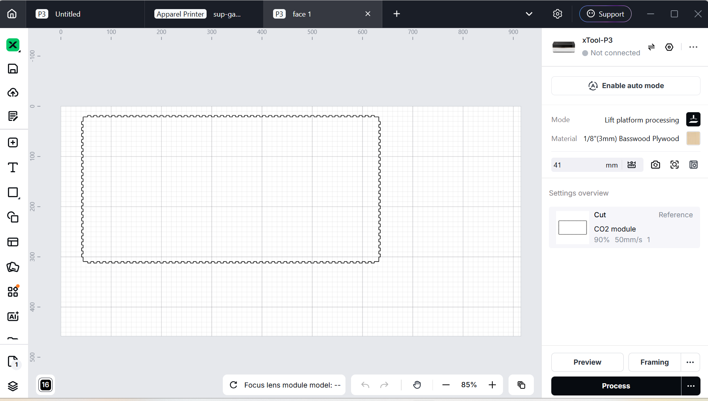

# Journal — Jeudi 10 Septembre 2026 (rédigé par : M'Ba Roland KUMENA)

## Fait aujourd'hui
- **Projet **  
    - Impression DTF de la maquette representant le carrefour

    - conception de la maquette pour souder les contre plaque pour obtenir un dimension de 60cm sur 60cm. 
    
    - Mise en place du circuit expérimental sur la breadboard.
    - Dimensionnement sur l'application en ligne **Boxes.py**
    
    - Découpe  laser des contreplaque pour assemblage. 

## Appris
- utilisation de Boxes py
- pratique de l'impression DTF.

## Raté, puis corrigé
-  interruption des impression dtf du au non nettoyage automatique de la machine.
## Décidé
- 

## À faire demain
- Assemblage de la decoupe laser pour former le support de base  — Groupe 4
- Montage du circuit et ecriture du code pour controler l'allumage des led selon le fonctionnement du feux tricolore  — Groupe 4

