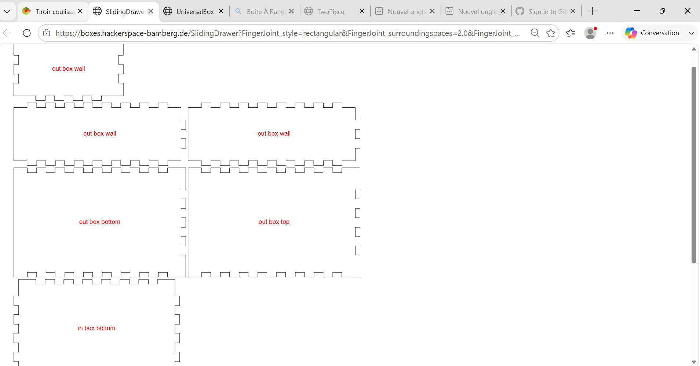

# Journal — Samedi 12 Septembre 2026 (rédigé par : M'Ba Roland KUMENA)

## Fait aujourd'hui
- **Projet **  
    - Conception et découpe d'un boitier.
    
    - Recherche d'un model 3D de voiture prêt à être imprimé sur printable 
    
    - Tranchage du model dans BambuStudio
    

    - conception de PCB du projet
    
    

## Appris
- Redimensionnement d'un model sur BambuStudio
- Conception et câblage du PCB.

## Raté, puis corrigé
-  Erreur de choix des composants dans Kicad et connexion entre les composants. 
## Décidé
- 

## À faire demain
- Impression 3D de la voiture   — Groupe 4
- Impression du PCB  — Groupe 4
- Boitier du système centrale  — Groupe 4

