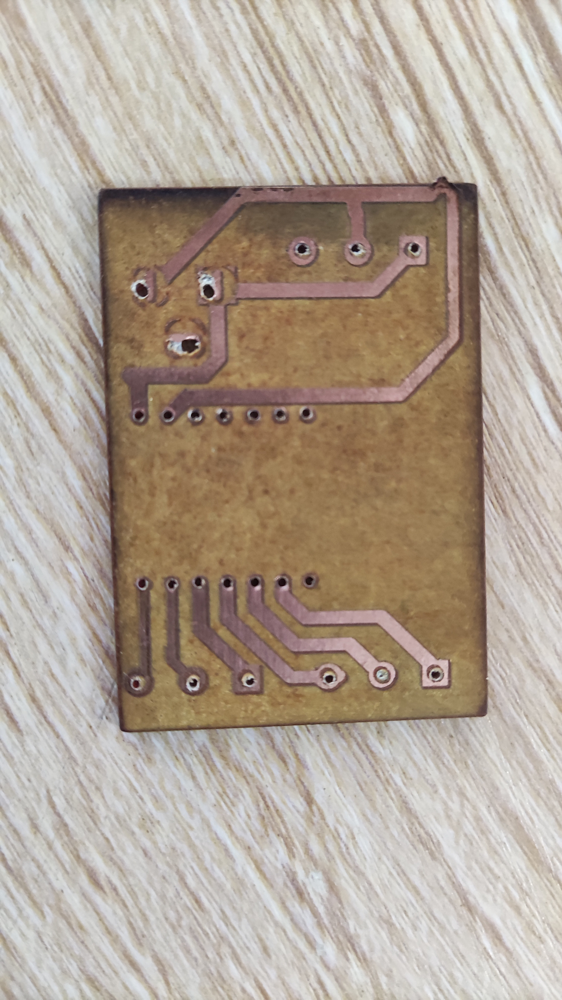
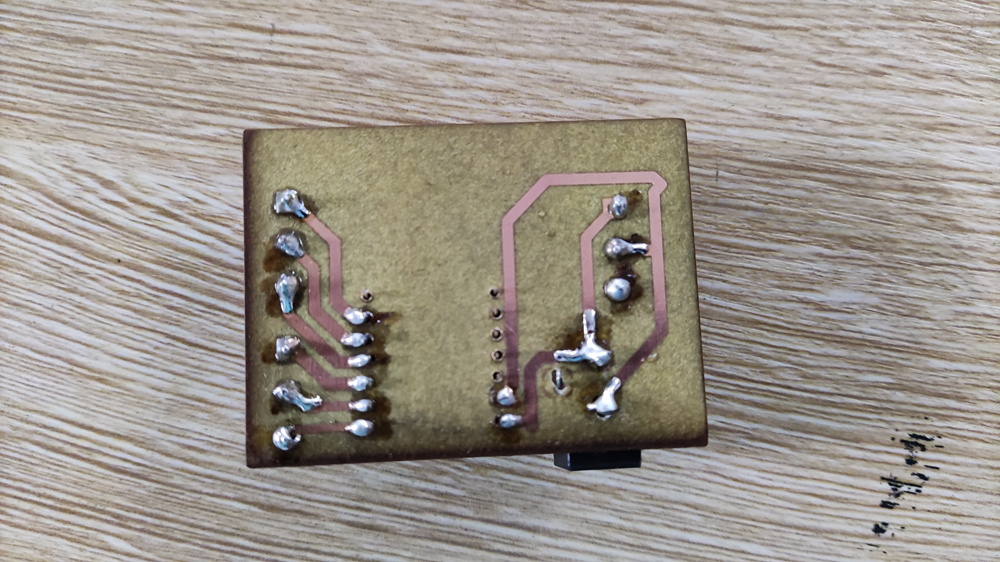

# Journal — Lundi 14 Septembre 2026 (rédigé par : M'Ba Roland KUMENA)

## Fait aujourd'hui
- **Projet **  
    - Renforcement de notre support.
    - Assemblage des composants sur notre PCB imprimé.
    
    
    .jpg)
    

    - impression 3D des voitures 

    

    
    

## Appris
- souder les composants sur un PCB

## Raté, puis corrigé
-  Les pattes des composants n'arrivent pas à traverser les trous du PCB. 
- inversion de l'emplacement des composants  
## Décidé
- 

## À faire demain
- Impression 3D de la voiture et du boitier  — Groupe 4

- Câblage et assemblage de feux tricolores   — Groupe 4

